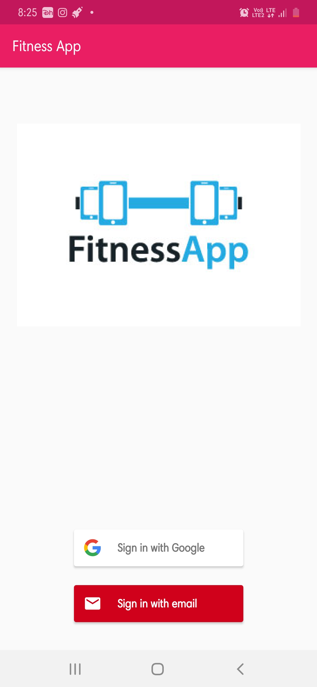
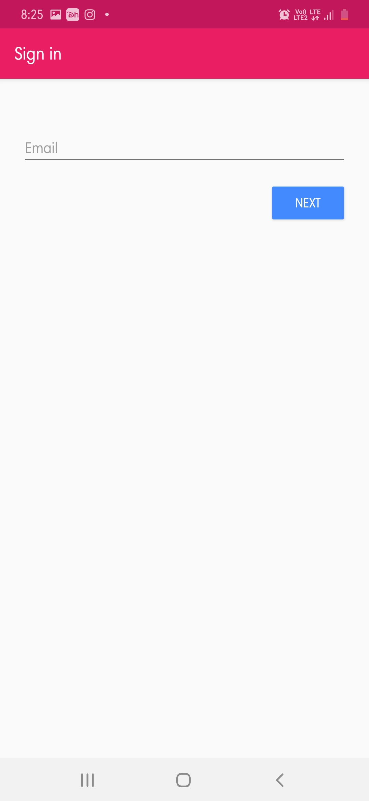
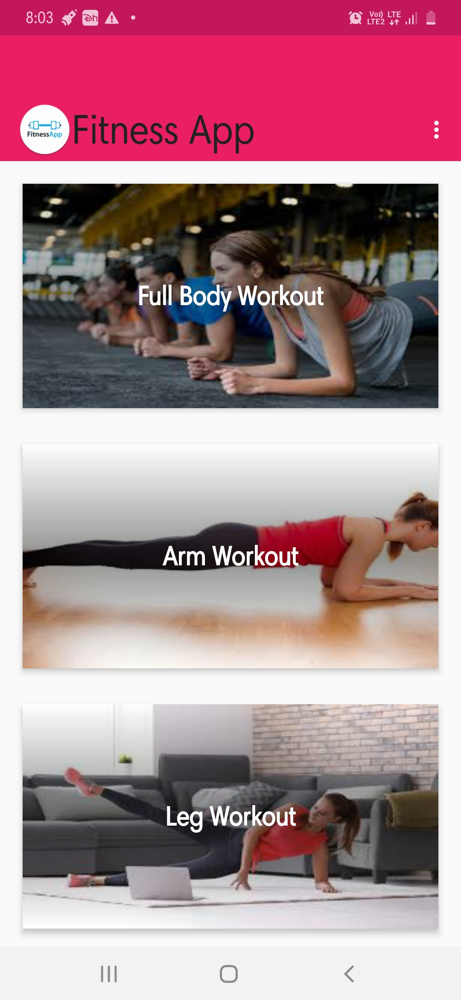
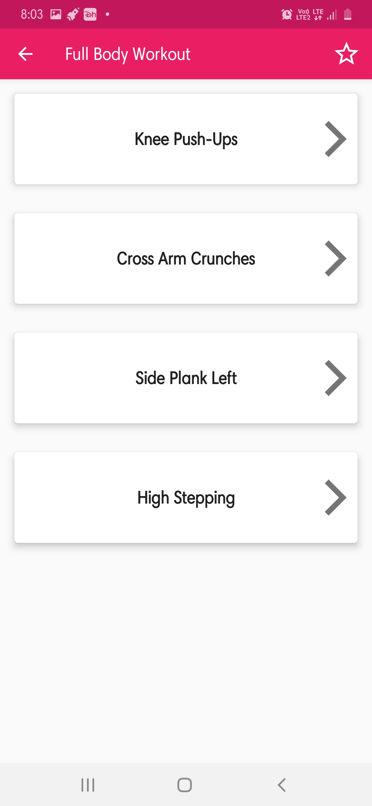
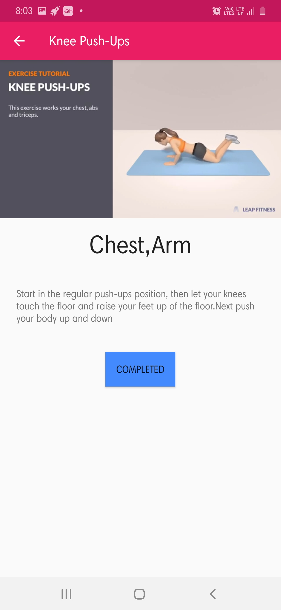

# FitnessApp
This app allows the users to keep track of their exersies. Provides different types of exercises to select and after completing these can marked as completed. A widget is provided 
to display the set of exercises.

## Screenshots

  
  

